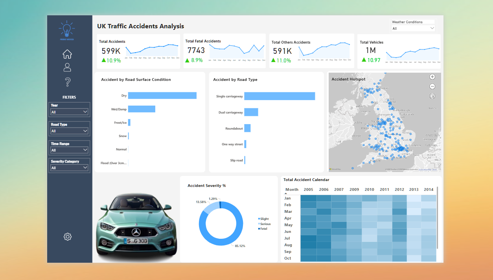

# UK Traffic Accidents Analysis in Power BI

## Introduction
Traffic accidents are a major concern in the UK, impacting lives, infrastructure, and public safety. Analyzing accident data can help identify patterns, risk factors, and high-risk areas, leading to more informed decisions on road safety policies and accident prevention strategies. This project leverages Power BI to visualize UK traffic accident data, enabling stakeholders to gain valuable insights.

## Problem Statement
The increasing number of road accidents in the UK requires a data-driven approach to understand contributing factors. This project aims to answer key questions such as:
- What are the trends in total, fatal, and non-fatal accidents over time?
- Which road conditions and types contribute most to accidents?
- What is the severity distribution of accidents?
- Where are the accident hotspots across the UK?
- By analyzing historical data, the project provides insights to assist policymakers, transportation authorities, and urban planners in improving road safety measures.

## Dataset
The dataset used for this analysis was sourced from Kaggle and contains comprehensive details on road accidents in the UK. The data includes:
- Accident severity (Slight, Serious, Fatal)
- Road type and classification
- Weather and road conditions
- Date and time of accidents
- Geographic coordinates of accident locations

## Data Modeling
The data model in Power BI consists of the following key components:
#### UK_Accident Table
Contains detailed accident-related attributes, including:
- Accident_Index
- Accident_Severity
- Carriageway_Hazards
- Date
- Day of WeekRoad classification (1st_Road_Class, 2nd_Road_Class)
- Road numbers (1st_Road_Number, 2nd_Road_Number)

#### DateTable
A structured table for time-based analysis, including:
- Date
- Month
- Monthnum
- Weekday
- Weeknum
- Year
The one-to-many relationship between DateTable and UK_Accident ensures efficient time-based analysis.

#### DAX Calculations Table
Contains calculated measures and columns to enhance analysis, such as:
- Total Accidents = COUNT(UK_Accident[Accident_Index])
- Accidents by Severity = SUM(UK_Accident[Accident_Severity])
- Rolling Averages for Monthly Trends
The data model allows for effective filtering, aggregation, and visualization of key insights.

## Data Transformation
Before visualization, the dataset underwent preprocessing in Power BI:
- Data Cleaning – Removing missing and duplicate values
- Data Formatting – Converting date fields, categorizing accident severity levels
- New Calculated Columns & Measures – Using DAX to derive additional insights

## Power BI Concepts Applied
Several key Power BI concepts were applied throughout this project to ensure effective data analysis and visualization:
1. Data Import & Cleaning
2. Data Modeling & Relationships
3. DAX (Data Analysis Expressions)
4. Data Visualization
5. Filters & Slicers
6. Conditional Formatting & Tooltips

## Data Visualization

[Watch Video](https://drive.google.com/file/d/1BJSYIwzPwG_wdX9ol3g8LAewYFPKJHu2/view?usp=sharing)

The Power BI dashboard provides interactive visualizations, including:

- Total accidents over time – Line charts showing monthly/yearly trends.
- Accident severity distribution – Pie charts or bar charts categorizing severity levels.
- Accidents by road condition and type – Horizontal bar charts.
- Geospatial accident analysis – A map highlighting accident hotspots across the UK.
- Accident calendar heatmap – Visualizing accident frequency by month and year.

  Interact with Dashboard [Here](https://app.powerbi.com/view?r=eyJrIjoiNTMwYzQ0MTAtOTk3Ni00MDczLTg2ZmEtM2JiNzEyYmI5MDhlIiwidCI6IjZiYjI1Yjk2LTlhZTItNDkxMy1hZTYxLThmOGE3NDNjYTY5NiJ9)

## Insights and Findings
Based on the analysis, key insights include:
- Accidents peak in certain months due to seasonal weather conditions.
- Single carriageways have the highest accident rates compared to other road types.
- Dry road conditions account for most accidents, but fatal accidents are more common on wet or icy roads.
- Accident hotspots can be identified for targeted safety interventions.

## Conclusion
This project demonstrates the power of data-driven analysis in understanding traffic accidents in the UK. Power BI enables interactive exploration of accident trends, severity, and contributing factors, providing valuable insights for decision-making. Future enhancements could include integrating real-time traffic data and predictive modeling to forecast accident risks.

- ✅ Created by: James Isaac
- ✅ Built with: Power BI
- ✅ Data Source: UK Accident dataset (Kaggle)
